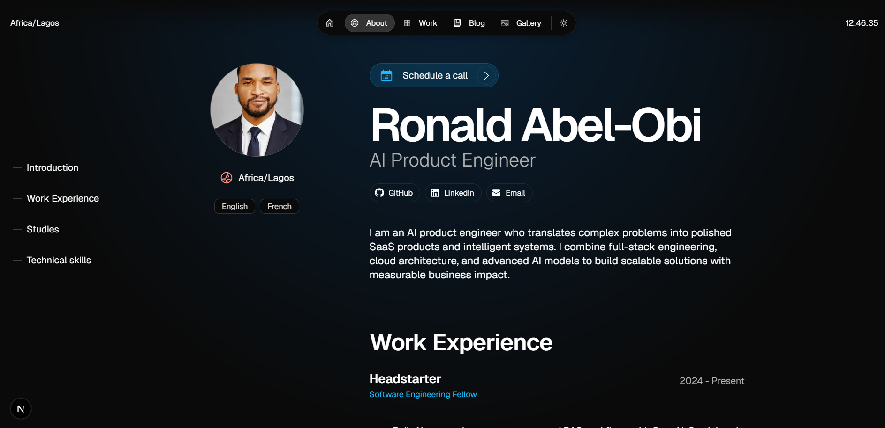

# Ronald Abel-Obi — AI-focused Full Stack Engineering Portfolio

A premium, production-ready portfolio for a software engineer building intelligent systems, scalable products, and modern web experiences.

---

## About

I’m Ronald Abel-Obi, an AI-focused Full Stack Engineer and Product Builder. I design and ship intelligent applications, from RAG systems and AI customer support to SaaS products and enterprise-grade web platforms. My experience spans AI SaaS development, CTO leadership, MERN applications, and AIoT innovation.

---

View the demo [here](https://ronald-portfolio.vercel.app).



## Features

- Responsive interface with polished visual hierarchy
- Project showcase with technical highlights and case studies
- MDX-powered blog support for writing technical content
- Lightweight animations and modern interaction patterns
- Dark / light mode support for user preference
- Performance-first implementation for fast page load
- SEO-friendly architecture for discoverability

---

## Tech Stack

- React
- Next.js
- TypeScript
- Node.js
- Tailwind CSS
- Firebase
- OpenAI
- Gemini
- MongoDB
- Vercel

---

## Projects Highlight

- **AI Code Assistant** — intelligent developer tooling for faster engineering workflows
- **Flashcard SaaS** — adaptive learning product with AI-powered study features
- **RAG AI Applications** — retrieval-augmented knowledge systems for data-driven experiences
- **AI Chatbot Systems** — conversational support solutions for customer success
- **Full Stack Applications** — end-to-end web products featuring modern architecture
- **AI-driven Products** — scalable systems built for impact and reliability

---

## Installation

```bash
git clone https://github.com/PhunkyGeek/rons-portfolio.git
cd ron-portfolio
npm install
npm run dev
```

---

## Folder Structure

- `src/app/` — page and route structure
- `src/components/` — shared UI components and layout
- `src/resources/` — site configuration and content
- `src/utils/` — helper utilities and data formatting
- `public/` — static assets and image resources

---

## Deployment

This portfolio is optimized for modern deployment platforms:

- Vercel
- Netlify
- GitHub Pages

---

## Author

**Ronald Abel-Obi**

- GitHub: https://github.com/PhunkyGeek
- LinkedIn: https://www.linkedin.com/in/ronald-abel-obi-a07654a5/
- Portfolio: https://ronald-portfolio.vercel.app

---

## License

Distributed under the CC BY-NC 4.0 License.